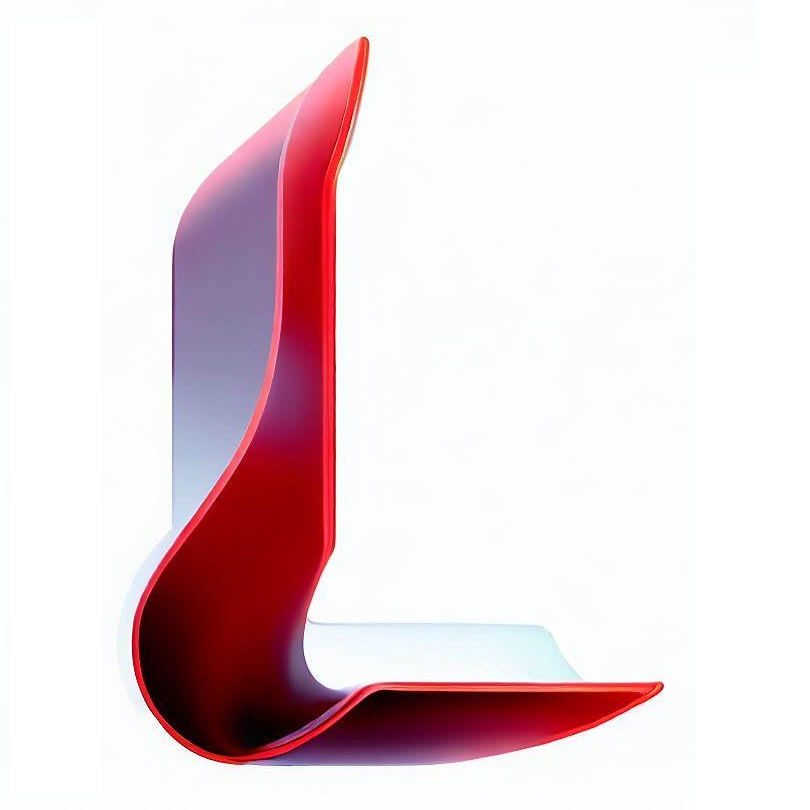

# LeagueFast

    

    一个基于LCU API开发的英雄联盟小助手

## 参考
- 拳头官方[开发者文档](https://developer.riotgames.com/docs/lol)
-  [Hextechdocs](https://hextechdocs.dev/tag/lcu/)
-  [API](https://www.mingweisamuel.com/lcu-schema/tool/)

## 环境
Java OpenJDK [Zulu-17](https://www.azul.com/downloads/?version=java-17-lts&package=jdk#zulu)

Maven 3.6.1
>  🐔 纯Java搓出来

## 客户端连接原理
通过Windows命令``wmic PROCESS WHERE name='LeagueClientUx.exe' GET commandline``

获取``Token``和``port`` 